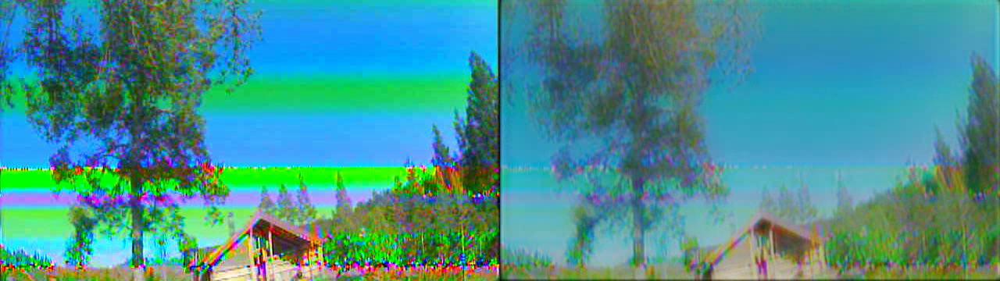
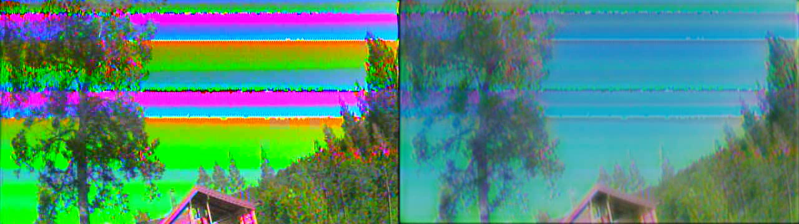
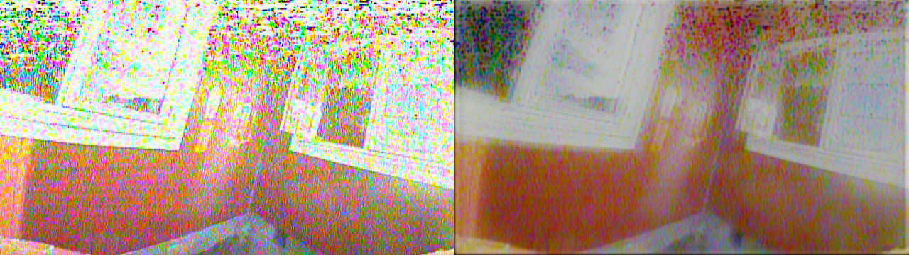
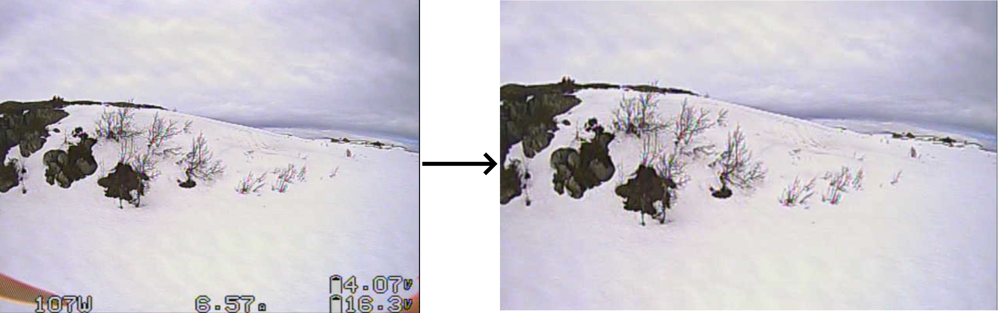

# Analog noise reduction

### Analog noise reduction for DVR
FPV goggles can record DVR, but the drone's transmitted video often contains too much analog noise to be enjoyable. AnalogNoiseReduction is a project aimed at removing analog noise from digital video recordings. The project uses an autoencoder powered by TensorFlow to remove analog noise. 
Example frames processed by the newest model: <br />
<p align="center">
Original -- Processed <br />



</p>
You can find more examples in the 'img/examples/' folder. Images recorded using the Newbeedrone Beebrain lite v2 have Bee in the title. This drone is too tiny for onboard recording, and the dataset used for training the model does not contain its video. 

### Usage
Beware of how big the model is. Processing requires a lot of RAM and VRAM. When testing with an RTX 3090, I found that processing one minute and 41 seconds of video took six minutes and 54 seconds. Even with the batch size set to 1, it took 8.5 gigabytes of VRAM and 60 gigabytes of RAM.
#
The input video should be an AVI file and be 640 by 480 pixels, the standard output format for many FPV goggles. The video is cropped to 640 by 360, which gives a 16:9 aspect ratio. To get the best results, you should put all the necessary OSD features in the area that gets cropped away. 

#
Due to the specific package version requirements, I recommend using Docker. Set up the environment by cloning the repository and building the Dockerfile after installing Docker with GPU support.
```sh
git clone https://github.com/luterlassus/AnalogNoiseReduction.git
cd AnalogNoiseReduction
git lfs install
git lfs pull
cd Docker/buildImage
docker build -t ll/anr .
```
Place the video you want the program to process in the /input folder and run the use script provided in the Docker folder. The script assumes that you cloned the repository into a folder called Github in your home directory. Edit the script if this is not the case.  
```sh
./use_ANR.sh example.AVI
```
The output will appear in the output folder after the script finishes. 
#
I have done most of the development using Jupyter notebooks. They make experimentation easier than regular python files, and they look better. You can use the other script in the Docker folder to start a Jupyter server in the docker container. 
```sh
./startANR.sh
```
Enjoy!


